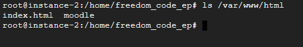

***INSTALANDO EL MOODLE Y TODO LO QUE NECESITAMOS***

```bash
~$ wget https://download.moodle.org/download.php/direct/stable400/moodle-latest-400.tgz
```


***INSTALAMOS APACHE***
```bash
~$ sudo apt install -y apache2
```


***Descomprimimos el archivo que acabamos de descargar en su directorio de instalación definitivo:***
```bash
~$ sudo tar xf moodle-latest-400.tgz -C /var/www/html/
```



***Moodle necesita también un directorio de datos que crearemos fuera del alcance de la navegación web:***
```bash
~$ sudo mkdir /var/www/moodledata
```
Como Moodle necesita escribir en ambas carpetas a través del servicio web, cambiaremos su propiedad al usuario con el que corre el servicio:
```bash
~$ sudo chown -R www-data: /var/www/html/moodle/ /var/www/moodledata/
```


***Moodle requiere la presencia en Debian 11 Bullseye de algunas extensiones de este lenguaje que instalaremos desde los repositorios del sistema.***
```bash
~$ sudo apt install -y php-{curl,gd,intl,mbstring,soap,xml,xmlrpc,zip}
```
<blockquote class="imgur-embed-pub" lang="en" data-id="a/ZUpTlJg" data-context="false" ><a href="//imgur.com/a/ZUpTlJg"></a></blockquote><script async src="//s.imgur.com/min/embed.js" charset="utf-8"></script>
```bash
~$ sudo nano /etc/php/8.0/apache2/php.ini
```
Buscamos la directiva `max_input_vars`:
```bash
;max_input_vars = 1000
```
Está desactivada, así que podemos activarla eliminando el carácter `;` inicial y modificando su valor por 5000, o la dejamos como está y añadimos en la siguiente línea la nueva definición:


Finalmente, recargamos la configuración del servicio web para que se puedan utilizar las nuevas extensiones y ajustes:
```bash
~$ sudo systemctl reload apache2
```

Si trabajamos remotamente sobre la máquina Debian 11, podemos realizar la descarga desde consola con alguna herramienta como `wget`:
```bash
~$ wget https://dev.mysql.com/get/mysql-apt-config_0.8.24-1_all.deb
```
Una vez descargado este paquete procedemos a instalarlo:
```bash
~$ sudo dpkg -i mysql-apt-config_0.8.24-1_all.deb
```


Conectamos al servicio con el cliente `mysql` y un usuario administrador:
```bash
~$ mysql -u root -p
```
Creamos la base de datos:
```sql
> create database moodle character set utf8mb4 collate utf8mb4_unicode_ci;
```
Creamos el usuario:
```sql
> create user moodle@localhost identified by 'XXXXXXXX';
```
Concedemos los permisos necesarios al usuario sobre la base de datos:
```sql
> grant all privileges on moodle.* to moodle@localhost;
```
Refrescamos la tabla de permisos:
```sql
> flush privileges;
```
Y cerramos la conexión:
```sql
> exit
```

***INSTALACIÓN DE MOODLE FINAL***


Comando utilizado para los usuarios: 
```bash
# tail -n 7 etc/passwd
```

***Software instalados: Apache***
***Instalación de Apache:***
```bash
sudo apt install apache2
```

Versión instalada de Apache2:
Comando para verificar la versión:
```bash
apache2 -v
```

***MySQL Server*** 
***Comando de instalación:***
```bash
sudo apt install mysql-server
```

Versión instalada de MySQL:
Comando de verificación:
```bash
mysql -V
```

***Php***
***Comando de instalación:***
```bash
sudo apt install php
```


Versión instalada de Php:
Comando de verificación: `php -V`
```


